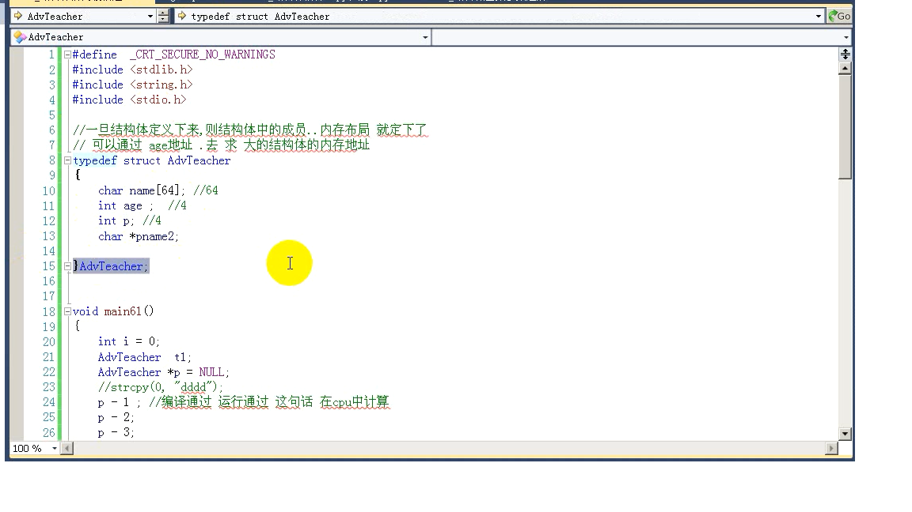

###### 错误	1	error LNK2019: 无法解析的外部符号 _WinMain@16，该符号在函数 ___tmainCRTStartup 中被引用	C:\Users\Administrator\Documents\Visual Studio 2012\Projects\namespace\namespace\MSVCRTD.lib(crtexew.obj)	namespace

此类错误是入口函数main() ,WinMain()调用错误

控制台是main()函数,win32是winmain()函数,在ide中项目菜单栏中选中当前项目的属性修改c/c++和link的属性将”_WINDOWS“改为"_CONSOLE"


c++强制转换

```c++
int a = 10;
int b = 3;

float c = static_cast<float>(a)/b;//数字型的用static，float表示目标类型，括号中的表示要转换的数
//c中
//float c = (float)a/b 

//不同类型要重新解释
int array[] = {1,2,3,4,5};
int *p = (int*)(reinterpret_cast<int>(array)+1);
//reinterpret_cast是重新解释的意思


//脱常类型转换

```


const跟#defined的区别

```C
#defined N 6
//预编译期间
//c++中const则在编译期间
```

c解决命名重复的问题

加static修饰符